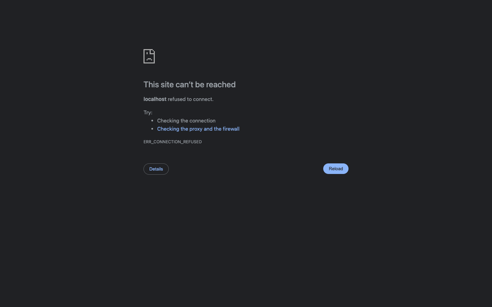

# Skycast — Weather Dashboard

> Live demo: **[Deploy link here after hosting]**

---

| Night / Empty state | Rain (Switzerland) | Sunny (America) |
|---|---|---|
|  |  | *(add yours)* |

---

## What it does

Search any city in the world and get instant weather. As you type, a geocoding dropdown surfaces matching city names so you never have to guess the exact spelling. Pick one, and the app fetches current conditions plus a 5-day forecast. The background shifts color and animates based on the actual weather — rain streaks down a canvas for wet conditions, stars twinkle at night, the sun pulses mid-day.

---

## Features

| | |
|---|---|
| City autocomplete | OWM Geocoding API, debounced at 280 ms, keyboard navigable |
| Geolocation | Browser `navigator.geolocation` → coords → weather |
| Search history | Last 6 cities persisted in `localStorage`, shown on focus |
| Unit toggle | Celsius ↔ Fahrenheit, re-fetches immediately |
| Live background | Canvas rain / snow / stars + Framer Motion ambient glows |
| Custom SVG icons | Animated, hand-authored per condition — no icon font |
| Loading skeletons | Shimmer placeholders during fetch to prevent layout shift |
| Error states | Dismissible inline banner with human-readable messages |
| Responsive | Works from 375px mobile up to wide desktop |

---

## Tech stack

| Layer | Choice | Why |
|---|---|---|
| Framework | Next.js 16 (App Router) | File-based routing, Server Components shell, Turbopack dev speed |
| Language | TypeScript | End-to-end type safety across API responses and component props |
| Styling | Tailwind CSS v4 | Utility-first, zero runtime, co-located with markup |
| Animation | Framer Motion | Layout animations, `AnimatePresence`, spring physics |
| Icons | Lucide React | Consistent stroke icons, tree-shakeable |
| Data | OpenWeatherMap API | Free tier covers `/weather`, `/forecast`, and `/geo/1.0/direct` |

---

## Architecture

```
Browser
  └── page.tsx (client component, owns all state)
        ├── useWeather hook         ← fetch orchestration + error handling
        │     ├── fetchWeatherByCity(city, units)
        │     └── fetchWeatherByCoords(lat, lon, units)
        ├── SearchBar               ← input, geocoding dropdown, geo button
        │     └── searchCitySuggestions(query)  ← OWM geo/1.0/direct
        ├── AnimatedBackground      ← canvas particles + motion glows
        ├── CurrentWeatherCard      ← big temp + stat pills grid
        ├── ForecastStrip           ← horizontal 5-day scroll
        ├── UnitToggle              ← °C / °F pill
        ├── LoadingSkeleton         ← shimmer during fetch
        └── ErrorState / EmptyState ← error + initial state
```

### Data flow

```
User types "Del..."
  → 280 ms debounce
  → GET /geo/1.0/direct?q=Del&limit=6
  → dropdown with [Delhi IN, Delray Beach US, ...]

User picks "Delhi"
  → GET /data/2.5/weather?q=Delhi&...    ─┐
  → GET /data/2.5/forecast?q=Delhi&...   ─┘ parallel
  → build CurrentWeather + ForecastDay[]
  → theme derived from conditionId + time-of-day
  → AnimatedBackground re-renders with new particle type
  → CurrentWeatherCard + ForecastStrip animate in
```

---

## Local setup

**1. Clone and install**

```bash
git clone https://github.com/VoidRaghav/CheckMe---Weather-Assignment
cd CheckMe---Weather-Assignment
npm install
```

**2. Get a free API key**

Sign up at [openweathermap.org/api](https://openweathermap.org/api). The free plan covers all three endpoints this app uses — no credit card needed.

**3. Set the key**

Create a `.env.local` file in the project root:

```
NEXT_PUBLIC_OWM_API_KEY=your_key_here
```

**4. Run**

```bash
npm run dev
```

Open [http://localhost:3000](http://localhost:3000).

**Build for production**

```bash
npm run build
npm start
```

---

## Deploy (Vercel — 2 minutes)

1. Push the repo to GitHub
2. Import it at [vercel.com/new](https://vercel.com/new)
3. Add `NEXT_PUBLIC_OWM_API_KEY` in Project → Settings → Environment Variables
4. Deploy — Vercel auto-detects Next.js, no config needed

---

## Project layout

```
app/
  layout.tsx          root layout, Inter font, metadata
  page.tsx            main page — state, theme, layout shell
  globals.css         Tailwind import, scrollbar, selection styles

components/
  AnimatedBackground  canvas rain/snow/stars + motion ambient glows
  WeatherIcon         custom animated SVG per condition type
  SearchBar           search input + autocomplete dropdown + history
  CurrentWeatherCard  hero temp card with stat pill grid
  ForecastStrip       5-day horizontal scroll strip
  UnitToggle          C°/F° animated pill switch
  LoadingSkeleton     shimmer placeholders
  ErrorState          dismissible error banner
  EmptyState          first-load prompt

hooks/
  useWeather.ts       fetch state machine (loading, error, data, geo)

lib/
  api.ts              OWM fetch functions + response mapping
  utils.ts            formatting, theme selection, localStorage history

types/
  weather.ts          shared TypeScript interfaces
```
